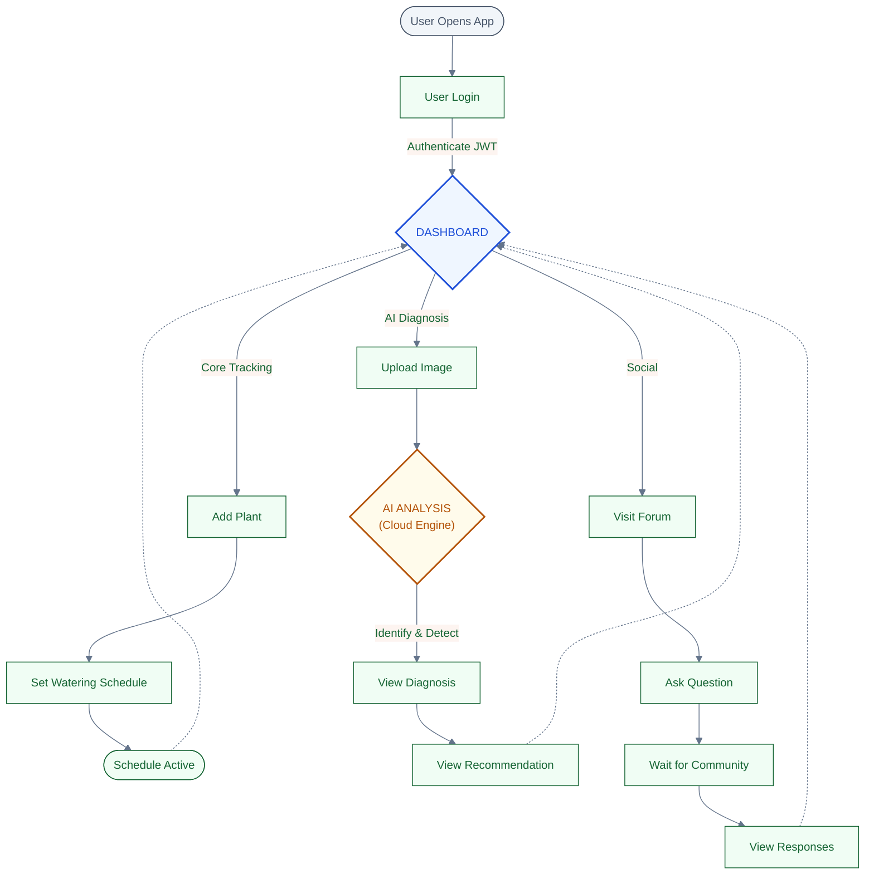

# PhytoVida - Smart Plant Care


**PhytoVida** is a robust and efficient full-stack plant management solution designed to eliminate plant care guesswork. It combines automated scheduling with AI-driven disease diagnostics to ensure your greenery thrives.

**[Live Demo]()** | **[API Documentation]()**

---

## Project Overview

### The Challenge

Modern plant owners face three primary hurdles that lead to poor plant health:

- **Inconsistency:** Busy schedules lead to forgotten watering and care routines.
- **Knowledge Gap:** Identifying diseases (like yellowing leaves or root rot) is difficult for hobbyists.
- **Fragmentation:** Care tips, tracking, and community advice are scattered across different apps and websites.

### The PhytoVida Vision

Our goal is to become the go-to ecosystem for smart gardening by:

1.  **Automating Care:** Eliminating forgetfulness through precision scheduling and smart reminders.
2.  **Democratizing Expertise:** Using AI diagnostics to provide instant, expert-level health insights.
3.  **Building Community:** Centralizing plant care knowledge through a peer-to-peer support network.

---

## Key Features

- **Watering Tracker:** Log and monitor watering history with persistent storage.

- **Smart Reminders:** Automated scheduling based on plant species needs.

- **AI Diagnosis:** Upload photos to identify pests, diseases, and nutrient deficiencies.

- **Community Forum:** Real-time Q&A and knowledge sharing for gardeners.

- **Planting Calendar:** Seasonal guidance and companion planting logic.

---

## Tech Stack

| Layer              | Technology                  | Key Features                                     |
| :----------------- | :-------------------------- | :----------------------------------------------- |
| **Frontend**       | **React 19**                | Hooks, Context API, Tailwind CSS                 |
| **Backend**        | **Node.js 22**              | Express Framework                                |
| **Database**       | **PostgreSQL 17**           | Relational care history & user data              |
| **AI Integration** | **Gemini**                  | Plant health analysis & disease diagnosis        |
| **DevOps**         | **Docker & Docker Compose** | Containerized microservices                      |
| **CI/CD**          | **GitHub Actions**          | Automated **Vitest** runs, linting, & deployment |

---

## Quick Start with Docker

Ensure you have **Docker 27** and **Docker Compose** installed.

1.  **Clone & Enter:**

    ```
    git clone https://github.com/username/phytovida.git && cd phytovida

    ```

2.  **Environment Setup:** Create a `.env`file in the root:

    ```
    DB_PASSWORD=your_secure_password
    AI_API_KEY=your_key_here
    NODE_ENV=production

    ```

3.  **Spin up the Stack:**

    ```
    docker-compose up --build

    ```

    - Frontend:`http://localhost:3000`

    - Backend API:`http://localhost:5000`

    - Postgres:`localhost:5432`

---

## System Architecture

The following flowchart illustrates the architectural workflow:



---

## Security & Performance

- **Load Time:** < 3s via optimized React builds and Postgres indexing.

- **Protection:** Bcrypt hashing for passwords and CORS policy headers.

- **Uptime:** 99.9% availability via containerized microservices.

---

## Meet the Team

| Name                     | Role          | Links                                                                                                                |
| :----------------------- | :------------ | :------------------------------------------------------------------------------------------------------------------- |
| **Tunde Ademola Kujore** | Product Owner | [GitHub](https://github.com/Dhemmyhardy) / [LinkedIn](https://www.linkedin.com/in/tundeademolakujore)                |
| **Daniel Kwame Afriyie** | Scrum Master  | [GitHub](https://github.com/dk-afriyie) / [LinkedIn](http://www.linkedin.com/in/danielkafriyie)                      |
| **Katie Hill**           | Web Developer | [GitHub]((https://github.com/KatieHill-Fr-Gr) / [LinkedIn](https://linkedin.com/in/katie-hill-fullstack)             |
| **Alwin Puche**          | Web Developer | [GitHub](https://github.com/awyyyn) / [LinkedIn](https://www.linkedin.com/in/lashtun/)                               |
| **Nadiia Lashtun**       | Web Developer | [GitHub](https://github.com/NadiiaLashtun) / [LinkedIn](https://www.linkedin.com/in/lashtun/)                        |
| **Pratyusha Dasari**     | Web Developer | [GitHub](https://github.com/pratyusha-ds) / [LinkedIn](https://www.linkedin.com/in/pratyusha-ds/)                    |
| **Banto-Laczi Klára**    | Web Developer | [GitHub](https://github.com/bantoklara) / [LinkedIn](https://www.linkedin.com/in/banto-laczi-klara/)                 |
| **Mohamed Ouederni**     | Web Developer | [GitHub](https://github.com/9-barristanselmy-9) / [LinkedIn](https://www.linkedin.com/in/mohamed-ouederni-0bb11ab4/) |

## License

This project is licensed under the MIT License - see the [LICENSE](https://opensource.org/license/mit/) file for details.
